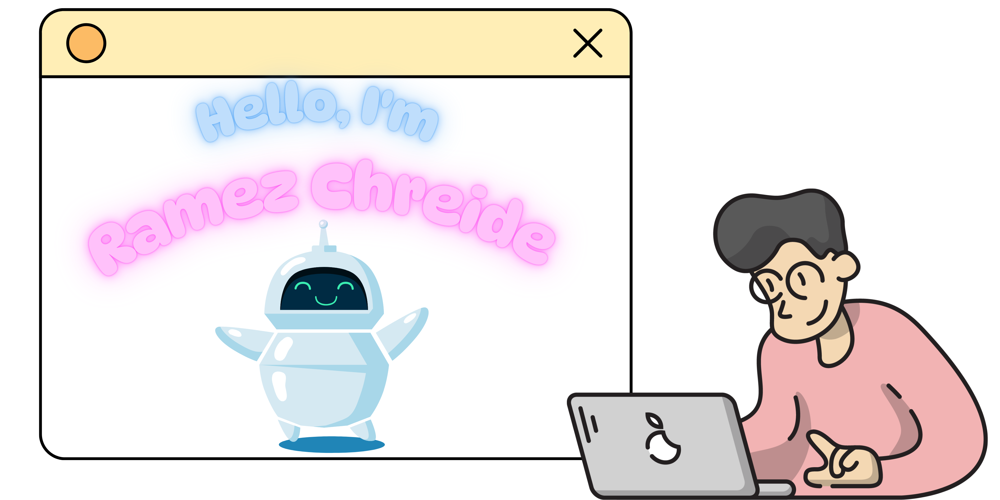

---

<h2>📊 Github Stats</h2>

  
  

---

## 👨‍💻 About Me  

  
  
  

👨‍👩‍👦 **Family-Oriented** | 💡 **Passionate Learner** | 🎮 **Valorant Enthusiast**  

- 🚀 I love learning new technologies and improving my skills every day.  
- 👨‍👩‍👦 When I’m not coding, I enjoy spending quality time with my family.  
- 🎯 You’ll often find me playing **Valorant** on the weekend.

---

## ⚙️ Tech Stack

| Frontend | Backend | Databases |
|----------|---------|-----------|
|  |  |  |

| Version Control | DevOps | Other Tools |
|------------------|--------|-------------|
|  |  | |

---

## 🏢 Projects

<ul style="list-style: none;">
  <li><a href="https://github.com/RamezCh/Internet_Supplier_Management_System" target="_blank">🔗 Internet Supplier Management System (Java/Spring+React/Typescript)</a></li>
  <li><a href="https://github.com/RamezCh/TradeHub" target="_blank">🔗 TradeHub E-Commerce Full-Stack MERN</a></li>
  <li><a href="https://github.com/RamezCh/ToDo-Backend" target="_blank">🔗 ToDo Backend</a></li>
  <li><a href="https://github.com/RamezCh/flask_machine_translation_eng_fr" target="_blank">🔗 Machine Translation Seq2Seq</a></li>
  <li><a href="https://github.com/RamezCh/CI-CD-using-Docker-Jenkins-Pipeline" target="_blank">🔗 CI/CD Docker & Jenkins</a></li>
  <li><a href="https://github.com/RamezCh/Automating-Infrastructure-using-Terraform" target="_blank">🔗 IaC Terraform</a></li>
</ul>

---

## 🔗 Let's Connect  

