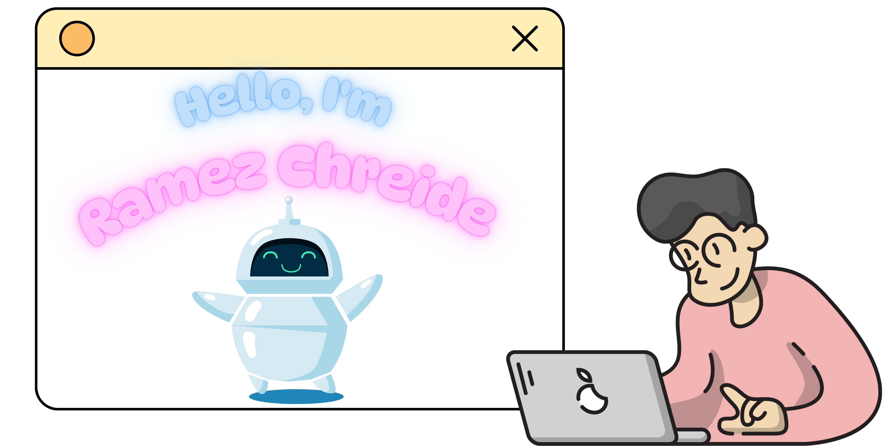

---

## 👨‍💻 About Me  

  
  
  

 

 

- 🚀 I love learning new technologies and improving my skills every day.  
- 👨‍👩‍👦 When I’m not coding, I enjoy spending quality time with my family.  
- 🎯 You’ll often find me playing **League of Legends** on the weekend.

---

## ⚙️ Tech Stack

| Frontend | Backend | Databases |
|----------|---------|-----------|
|  |  |  |

| Version Control | DevOps | Other Tools |
|------------------|--------|-------------|
|  |  | |

